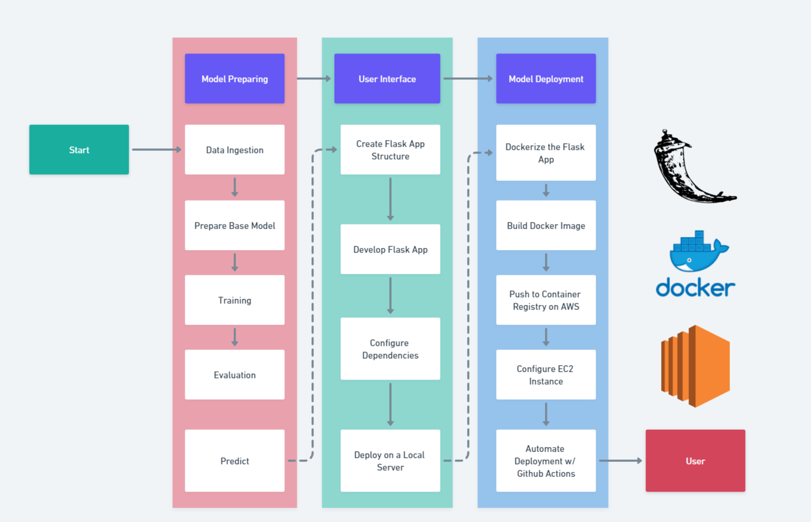
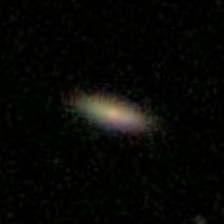
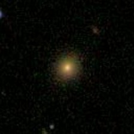
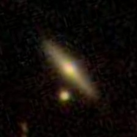
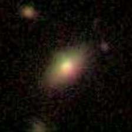
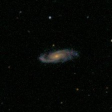

# End-to-End-Galaxy-Classification



## Table of Contents
- [Project Introduction](#project-introduction)
- [Model Preparation](#model-preparation)
- [User Interface Development](#user-interface-development)
- [Model Deployment and Automation](#model-deployment-and-automation)
- [How to run?](#steps)
---
# Project Introduction

This project focuses on using deep learning techniques to classify different types of galaxies based on their images. The goal is to develop a machine learning model that can accurately distinguish between various galaxy shapes and configurations.

## Project Overview

Galaxy classification is a critical task in astronomy that helps scientists understand the nature and evolution of galaxies. This project leverages deep learning algorithms to automate this classification process, enabling faster and more efficient analysis of large datasets of galaxy images.

## Galaxy Types

The dataset used in this project contains images of different galaxy types, each belonging to one of the following categories:

### Cigar-shaped Smooth

Galaxies in this category have a smooth appearance with a cigar-like shape. They lack prominent features like spiral arms or irregular structures.



### Completely Round Smooth

These galaxies have a smooth and completely round appearance without any distinct asymmetry or features.



### Edge-On

Edge-on galaxies are characterized by their orientation, where their disk-like structure is viewed nearly edge-on from our perspective.



### In Between Smooth

Galaxies that fall into this category exhibit a smooth appearance but with some irregularities or features that make them distinct from completely smooth galaxies.



### Spiral

Spiral galaxies showcase prominent spiral arms that often contain star-forming regions. These galaxies have a well-defined structure.



## Data Preparation

The dataset is organized with labeled images representing each galaxy type. The images undergo preprocessing, including resizing, normalization, and augmentation, to ensure optimal training conditions for the deep learning model.

## Model Architecture

The deep learning model employed in this project is designed to learn features from the galaxy images and make accurate predictions about their types. Convolutional Neural Networks (CNNs) are commonly used for image classification tasks due to their ability to capture spatial patterns and hierarchies of features.

## Usage

To use this project, follow these steps:

1. **Data Preparation:** Organize your galaxy image dataset into categories.
2. **Model Training:** Train the deep learning model using the prepared dataset.
3. **Evaluation:** Evaluate the model's performance on a separate validation set.
4. **Prediction:** Utilize the trained model to classify new galaxy images.

Feel free to explore the provided code and adapt it to your own galaxy image classification tasks.

---


## Model Preparation

1. **Data Ingestion**
   - Description: Ingest raw data from various sources and prepare it for training.
   - Tasks: Data collection, data preprocessing, and transformation.

2. **Prepare Base Model**
   - Description: Create a basic machine learning model that will serve as the starting point for training.
   - Tasks: Model architecture selection, parameter initialization.

3. **Training**
   - Description: Train the base model using the prepared data.
   - Tasks: Model training, optimization, hyperparameter tuning.

4. **Evaluation**
   - Description: Evaluate the trained model's performance to assess its accuracy and other relevant metrics.
   - Tasks: Model validation, metric calculation.

5. **Prediction**
   - Description: Apply the trained model to make predictions on new data.
   - Tasks: Implement prediction functionality, integration with data pipelines.

## User Interface Development

1. **Create Flask App Structure**
   - Description: Set up the directory structure and files for the Flask web application.
   - Tasks: Folder creation, file setup.

2. **Develop Flask App**
   - Description: Write the Flask application code to handle user interactions and serve model predictions.
   - Tasks: Route definitions, views, template rendering.

3. **Configure Dependencies**
   - Description: Specify the required Python packages and libraries for the Flask app.
   - Tasks: Create a `requirements.txt` file.

4. **Deploy on a Local Server**
   - Description: Test the Flask app on a local development server to ensure functionality.
   - Tasks: Use the `flask run` command to start the app locally.

5. **User Interface Testing**
   - Description: Conduct thorough testing of the user interface to ensure a seamless user experience.
   - Tasks: UI testing, bug fixing.

## Model Deployment and Automation

1. **Dockerize the Flask App**
   - Description: Create a Dockerfile to containerize the Flask app for easy deployment.
   - Tasks: Define the Dockerfile, specify dependencies.

2. **Build Docker Image**
   - Description: Build a Docker image of the Flask app with the necessary dependencies.
   - Tasks: Use the Docker CLI to build the image.

3. **Push to Container Registry on AWS**
   - Description: Push the Docker image to an AWS container registry for storage and deployment.
   - Tasks: Set up an AWS container registry, push the image.

4. **Configure EC2 Instance**
   - Description: Set up an EC2 instance on AWS to host the deployed app.
   - Tasks: Instance creation, security group configuration, Docker installation.

5. **Automate Deployment with Github Actions**
   - Description: Create a GitHub Actions workflow to automate the deployment process.
   - Tasks: Define the workflow YAML, specify build and deployment steps.

---

# How to run?
### STEPS:

Clone the repository

```bash
https://github.com/Apheironn//End-to-End-Galaxy-Classification
```
### STEP 01- Create a conda environment after opening the repository

```bash
conda create -n mlproj python=3.10 -y
```

```bash
conda activate mlproj
```


### STEP 02- install the requirements
```bash
pip install -r requirements.txt
```


```bash
# Finally run the following command
python app.py
```

Now,
```bash
# Open up you local host and port
localhost:8080
```

First go to,
```bash
# You have to train your data first on:
localhost:8080/train
```

Finally,
```bash
# Go back to main address and enter values to estimate the price of the vehicle:
localhost:8080/
```
---

## Note for GPU Usage and Configuration

- **GPU Usage and TensorFlow Compatibility:** If you want use your GPU for machine learning on Windows with Tensorflow, it's important to note that TensorFlow has partially stopped support for running on video cards in Windows after version 2.10. You can find more information about this in the [official TensorFlow documentation](https://www.tensorflow.org/install/pip). To use the latest supported version, follow these steps:

  1. Create a Conda environment with Python 3.10:
      ```
      conda create --name tensorflowgpu python=3.10
      ```

  2. Activate the Conda environment:
      ```
      conda activate tensorflowgpu
      ```

  3. Install CUDA Toolkit and cuDNN via Conda:
      ```
      conda install -c conda-forge cudatoolkit=11.2 cudnn=8.1.0
      ```

  4. Install TensorFlow version 2.10:
      ```
      pip install tensorflow==2.10
      ```

- **Customizing Training Parameters:** In the `params.yaml` file, you can enter your own values to train your model. The project uses the model from the file named `best_model.h5`, assuming the training process has been previously completed. If you want to use a different model, you can modify the configuration in the `config.yaml` file.

---


## License

This project is licensed under the [MIT License](LICENSE).
